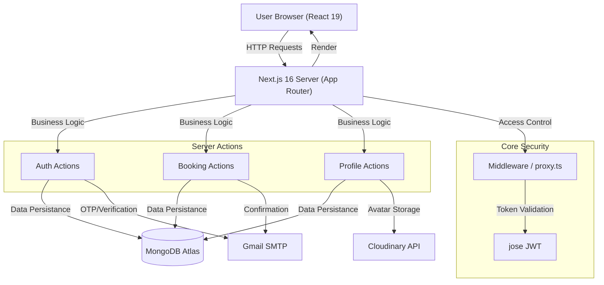

# The African Palace 🏨

A premium, mobile-first hospitality platform for the "African Palace" in Tamale. Featuring a cinematic UI/UX, persistent favorites, real-time booking systems, and secure member authentication.

[](https://vercel.com/new/clone?repository-url=https%3A%2F%2Fgithub.com%2FOwusu1946%2Fafricanpalace&env=MONGODB_URI,JWT_SECRET,SMTP_HOST,SMTP_PORT,SMTP_USER,SMTP_PASS,CLOUDINARY_CLOUD_NAME,CLOUDINARY_API_KEY,CLOUDINARY_API_SECRET,CLOUDINARY_UPLOAD_PRESET,NEXT_PUBLIC_BASE_URL&project-name=africanpalace&repository-name=africanpalace)

## 🏗️ Architecture



## ✨ Features

- **Cinematic UI**: Hand-crafted vanilla CSS animations and high-end typography.
- **Secure Authentication**: JWT-based sessions, OTP email verification, and password reset flows.
- **Persistent Favorites**: MongoDB-backed favorites with optimistic UI updates and local caching.
- **Real-time Bookings**: Multi-step checkout flow with automated email confirmations.
- **Member Dashboard**: Profile editing, avatar uploads (Cloudinary), and booking history.
- **Interactive Gallery**: Masonry-grid layout with a functional lightbox.
- **Responsible Design**: Tailored experiences for mobile and desktop using modern CSS techniques.

## 🛠️ Tech Stack

- **Framework**: [Next.js 16](https://nextjs.org/) (App Router, Turbopack)
- **Database**: [MongoDB Atlas](https://www.mongodb.com/atlas)
- **Styling**: Vanilla CSS (CSS Modules & Global) & [Tailwind CSS](https://tailwindcss.com/)
- **Media**: [Cloudinary](https://cloudinary.com/) (Avatar storage)
- **Email**: [Nodemailer](https://nodemailer.com/) (Gmail SMTP)
- **Security**: [bcryptjs](https://github.com/dcodeIO/bcrypt.js) (Hashing) & [jose](https://github.com/panva/jose) (JWT)

## 📁 Architecture & Structure

```text
seyramz/
├── app/                  # Next.js App Router
│   ├── actions/          # Server Actions (auth, booking, profile)
│   ├── profile/          # Member dashboard
│   ├── rooms/            # Room listings & Checkout
│   └── (auth)/           # Login, Signup, Password Reset
├── components/           # Shared UI components (Header, Footer, Hero)
├── lib/                  # Shared utilities (MongoDB client, Auth, Email)
├── public/               # static assets (Images, Videos)
├── proxy.ts              # Middleware for route protection
└── next.config.ts        # Next.js configuration
```

## 🔑 Environment Variables Setup

Create a `.env.local` file in the root directory and populate it with the following:

### 1. MongoDB Atlas (`MONGODB_URI`)
1. Create a free cluster at [MongoDB Atlas](https://www.mongodb.com/cloud/atlas).
2. Go to **Network Access** and add `0.0.0.0/0` (Allow all IPs).
3. Go to **Database Access** and create a user with "Read and Write" permissions.
4. Click **Connect** -> **Drivers** -> Copy the connection string.
5. Replace `<password>` with your user's password.

### 2. Cloudinary (`CLOUDINARY_*`) — *Step-by-Step*
1. Sign up/Login at [Cloudinary](https://cloudinary.com/).
2. Go to your **Dashboard**.
3. Copy **Cloud Name**, **API Key**, and **API Secret**.
4. Go to **Settings (Gear Icon)** -> **Upload** -> **Upload Presets**.
5. Create a new "Unsigned" preset and copy its name for `CLOUDINARY_UPLOAD_PRESET`.

### 3. SMTP Settings — *Gmail Instructions*
1. Go to your [Google Account Settings](https://myaccount.google.com/).
2. Enable **2-Step Verification**.
3. Search for **App Passwords**.
4. Create a new app password (select "Mail" and "Other").
5. Use the 16-character code as your `SMTP_PASS`.

```env
MONGODB_URI=your_mongodb_uri
JWT_SECRET=your_random_long_secret_string
NODE_ENV=development # set to production in vercel

SMTP_HOST=smtp.gmail.com
SMTP_PORT=587
SMTP_USER=your_email@gmail.com
SMTP_PASS=your_app_password

CLOUDINARY_CLOUD_NAME=your_cloud_name
CLOUDINARY_API_KEY=your_api_key
CLOUDINARY_API_SECRET=your_api_secret
CLOUDINARY_UPLOAD_PRESET=your_unsigned_preset_name

NEXT_PUBLIC_BASE_URL=http://localhost:3000
```

## 🚀 Getting Started

1. **Clone the repo**:
   ```bash
   git clone https://github.com/Owusu1946/africanpalace.git
   cd seyramz
   ```

2. **Install dependencies**:
   ```bash
   npm install
   ```

3. **Run the development server**:
   ```bash
   npm run dev
   ```

4. **Build for production**:
   ```bash
   npm run build
   npm start
   ```

## 📄 License

This project is licensed under the MIT License - see the [LICENSE](LICENSE) file for details.

## 🤝 Contributing

Contributions are welcome! Please read the [CONTRIBUTING.md](CONTRIBUTING.md) for details on our code of conduct and the process for submitting pull requests.

Reserved for The African Palace, Tamale.
